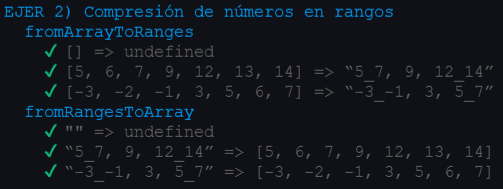
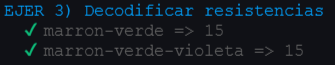
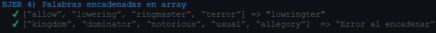
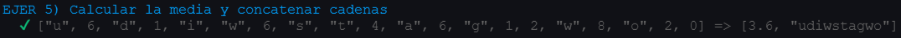
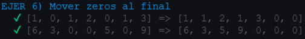
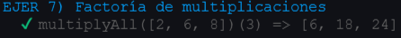
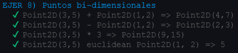
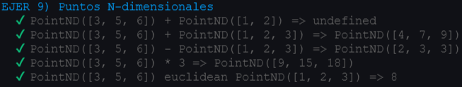
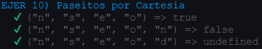

# Práctica 4 - DSI
## Arrays, tuplas y enumerados

### Índice de ejercicios

-[Ejercicio 1  - Tablas de multiplicar](#e1)

-[Ejercicio 2  - Compresión de números en rangos](#e2)

-[Ejercicio 3  - Decodificar resistencias](#e3)

-[Ejercicio 4  - Palabras encadenadas en un array](#e4)

-[Ejercicio 5  - Calcular la media y concatenar cadenas](#e5)

-[Ejercicio 6  - Mover zeros al final](#e6)

-[Ejercicio 7  - Factoría de multiplicaciones](#e7)

-[Ejercicio 8  - Puntos bi-dimensionales](#e8)

-[Ejercicio 9  - Puntos N-dimensionales](#e9)

-[Ejercicio 10 - El Cartesiano](#e10)


### Introducción

En este nuevo proyecto, emplearemos un desarrollo dirigido por pruebas (TDD) y estará documentado, para lo 
que vamos a valernos de tres herramientas para llevarlo a cabo:

* [Mocha](https://mochajs.org/) y [Chai](https://www.chaijs.com/): para incorporar TDD.
* [Typedoc](https://typedoc.org/): para realizar la documentación automática de nuestro codigo.

Para que `Typedoc` funcione, todas las funciones que aparecen en esta practica disponen de un comentario en la parte
superior de la siguiente forma:

```Typescript
/**
 * Devuelve un array de arrays con n tablas de multiplicar,
 * donde cada tabla de multiplicar contiene los primeros n
 * productos.
 * @param n número de tablas de multiplicar. n >= 1
 * @return number[][] conteniendo las tablas generadas
 * o undefined si n < 1
 */
```
**Comentario superior de la funcion nº1 `productTable`**

Continuaremos con la misma estructura de directorios basada en las anteriores prácticas, añadiendo el nuevo
directorio `test` para alojar las expectativas del código y `Typedocumentation` para almacenar la
documentación generada por `Typedoc`.

Con todo esto implementaremos 10 funciones propuestas, repasando conceptos sobre los apartados vistos en 
clase:
* [Creación de un proyecto inicial con Typescript](https://ull-esit-inf-dsi-2122.github.io/typescript-theory/typescript-project-setup.html)
* [Tipos de datos estáticos](https://ull-esit-inf-dsi-2122.github.io/typescript-theory/typescript-static-types.html)
* [Funciones](https://ull-esit-inf-dsi-2122.github.io/typescript-theory/typescript-functions.html)
* [Arrays, tuplas y enumerados](https://ull-esit-inf-dsi-2122.github.io/typescript-theory/typescript-arrays-tuples-enums.html)

## Ejercicios

### Ejercicio 1 - Tablas de multiplicar<a name="e1"></a>

Crearemos una funcion que reciba un numero `n >= 1` y devolvera un array de arrays conteniendo `n` tablas
de multiplicar, cada una con los `n` primeros productos.

``` Typescript
export function productTable(n: number): number[][] | undefined {
  if (n < 1) {
    return undefined;
  }
  const result: number[][] = [];
  for (let i: number = 1; i <= n; i++) {
    const aux: number[] = [];
    for (let j: number = 1; j <= n; j++) {
      aux.push(i*j);
    }
    result.push(aux);
  }
  return result;
}
```
**Pruebas**
```Typescript
import {productTable} from '../src/ejer-1';

describe('EJER 1) Tablas de multiplicar', () => {
  it('n = 0 | Resultado : undefined', () => {
    expect(productTable(0)).to.be.deep.equal(undefined);
  });
  it('n = 1 | Resultado : [[1]]', () => {
    expect(productTable(1)).to.be.deep.equal([[1]]);
  });
  it('n = 2 | Resultado : [[1, 2], [2, 4]]', () => {
    expect(productTable(2)).to.be.deep.equal([[1, 2], [2, 4]]);
  });
  it('n = 3 | Resultado : [[1, 2, 3], [2, 4, 6], [3, 6, 9]]', () => {
    expect(productTable(3)).to.deep.equal([[1, 2, 3], [2, 4, 6], [3, 6, 9]]);
  });
  it('n = 4 | Resultado : [[1, 2, 3, 4], [2, 4, 6, 8], [3, 6, 9, 12], [4, 8, 12, 16]]', () => {
    expect(productTable(4)).to.deep.equal([[1, 2, 3, 4], [2, 4, 6, 8], [3, 6, 9, 12], [4, 8, 12, 16]]);
  });
});
```


***

### Ejercicio 2 - Compresión de números en rangos<a name="e2"></a>

Vamos a convertir un array de enteros en una cadena representando los rangos entre estos
separados por `'_'` y cada uno separado por `','`. Ejemplo:
 `[5, 6, 7, 9, 12, 13, 14] => “5_7, 9, 12_14”`
 
Para ello recorremos el vector y en cada elemento, guardamos el primero numero en `ini` y vemos si los
siguientes son consecutivos: `(v[j + 1] == v[j] + 1))`, una vez sepamos cuantos numeros consecutivos
tenemos, guardamos la posicion del ultimo en `j`, y si son el mismo, añadimos ese numero directamente a
la cadena resultado, si no (hay un rango), añadimos ese rango desde `ini` hasta `j`.

``` Typescript
export function fromArrayToRanges(v: number[]): string | undefined {
  if (v.length < 1) {
    return undefined;
  }

  let out: string = '';
  let j: number = 0;
  let c: number = 0;
  for (let i: number = 0; i < v.length; i++) {
    j = i;
    let d: number = 0;
    const ini: string = v[i].toString(); // Guardamos el primer numero del rango
    while ((j < v.length - 1) && (v[j + 1] == v[j] + 1)) {
      d++;
      j++;
      i++;
    }
    if (c > 0) {
      out += ', ';
    }
    if (d > 0) {
      out += ini + '_' + v[j].toString();
    } else {
      out += ini;
    }
    c++; // Para la coma
  }
  return out;
}
```
**Pruebas**
```Typescript
import {fromArrayToRanges, fromRangesToArray} from '../src/ejer-2';
 describe('fromArrayToRanges', () => {
    it('[] => undefined', () => {
      expect(fromArrayToRanges([])).to.be.equal(undefined);
    });
    it('[5, 6, 7, 9, 12, 13, 14] => “5_7, 9, 12_14”', () => {
      expect(fromArrayToRanges([5, 6, 7, 9, 12, 13, 14])).to.be.deep.equal('5_7, 9, 12_14');
    });
    it('[-3, -2, -1, 3, 5, 6, 7] => “-3_-1, 3, 5_7”', () => {
      expect(fromArrayToRanges([-3, -2, -1, 3, 5, 6, 7])).to.be.deep.equal('-3_-1, 3, 5_7');
    });
  });
```

Ademas, también implementaremos el proceso inverso, en el que trataremos la cadena de entrada
para separar cada rango por `','` e introducirlos en un vector.
Para cada rango `v[i]` una `string`. Comprobamos si incluye el caracter `'_'`:
* Si tiene: obtenemos las cadenas a cada lado del `'_'` , las transformamos en numeros y con
  un bucle introducimos todos los numeros includos en ese rango en el vector resultado.
* Si mo tiene: es un rango unitario, simplemente convertimos la cadena en un numero y lo
  incluimos al vector.

``` Typescript
export function fromRangesToArray(entry: string):number[] | undefined {
  const cad: string = entry.replace(/ /g, '');
  const ranges: string[] = cad.split(',');
  const output: number[] = [];

  if (cad.length < 1) {
    return undefined;
  }

  for (let i: number = 0; i < ranges.length; i++) {
    if (ranges[i].includes('_')){
      const n1: number = parseInt(ranges[i].split('_')[0]);
      const n2: number = parseInt(ranges[i].split('_')[1]);
      for (let i: number = n1; i <= n2; i++) {
        output.push(i);
      }
    } else {
      output.push(parseInt(ranges[i]));
    }
  }

  return output;
}
```
**Pruebas**
```Typescript
  describe('fromRangesToArray', () => {
    it('"" => undefined', () => {
      expect(fromArrayToRanges([])).to.be.equal(undefined);
    });
    it('“5_7, 9, 12_14” => [5, 6, 7, 9, 12, 13, 14]', () => {
      expect(fromRangesToArray('5_7, 9, 12_14')).to.be.deep.equal([5, 6, 7, 9, 12, 13, 14]);
    });
    it('“-3_-1, 3, 5_7” => [-3, -2, -1, 3, 5, 6, 7]', () => {
      expect(fromRangesToArray('-3_-1, 3, 5_7')).to.be.deep.equal([-3, -2, -1, 3, 5, 6, 7]);
    });
  });
```


***

### Ejercicio 3 - Decodificar resistencias<a name="e3"></a>

Implementa una traducción de las bandas de colores de las resistencias para calcular su valor real.
Este valor es igual numero resultante de concatenar el digito asociado al primer color con el del 
segundo. Si la función recibe más de dos colores, estos serán ignorados.

``` Typescript
export enum color {negro, marron, rojo, naranja, amarillo, verde, azul, violeta, gris, blanco};

export function decodeResistor(c1: color, c2:color, ...rest): number | undefined {
  if (( 8 < c1 || c1 < 0) || ( 8 < c2 || c2 < 0)) {
    return undefined;
  }
  return c1 * 10 + c2;
}
```
**Pruebas**
```Typescript
describe('EJER 3) Decodificar resistencias', () => {
  it('marron-verde => 15', () => {
    expect(decodeResistor(color.marron, color.verde)).to.be.equal(15);
  });
  it('marron-verde-violeta => 15', () => {
    expect(decodeResistor(color.marron, color.verde, color.violeta)).to.be.equal(15);
  });
});
```


*** 

### Ejercicio 4 - Palabras encadenadas en un array<a name="e4"></a>

Implentaremos una función que comprueba si las cadenas de un array de cadenas son encadenadas,
es decir, una parte del final de cada palabra es igual que otra parte del inicio de la siguiente
y devuelva una string resultado de concatenar todas estas partes iguales.

El metodo recorre cada palabra para compararla con la siguiente 

``` Typescript
export function meshArray(v: string[]): string {
  let out: string = '';
  for (let i: number = 0; i < v.length - 1; i++) {
    const aLen: number = v[i].length;
    const nLen: number = v[i + 1].length;
    let aux: string = '';
    let Match: boolean = false;

    if (aLen == 0 || nLen == 0) {
      return 'Error al encadenar';
    }
    const size: number = Math.min(aLen, nLen);
    for (let j: number = size; j >= 0 && !Match; j--) {
      if (v[i].substring(aLen - j) == v[i+1].substring(0, j)) {
        Match = true;
        aux = v[i].substring(aLen - j);
      }
    }
    if (aux.length == 0) {
      return 'Error al encadenar';
    } else {
      out += aux;
    }
  }
  return out;
}
```
**Pruebas**
```Typescript
describe('EJER 4) Palabras encadenadas en array', () => {
  it('[“allow”, “lowering”, “ringmaster”, “terror”] => "lowringter"', () => {
    expect(meshArray(['allow', 'lowering', 'ringmaster', 'terror'])).to.be.equal('lowringter');
  });
  it('[“kingdom”, “dominator”, “notorious”, “usual”, “allegory”]  => “Error al encadenar”', () => {
    expect(meshArray(['kingdom', 'dominator', 'notorious', 'usual', 'allegory'])).to.be.equal('Error al encadenar');
  });
});
```


***

### Ejercicio 5 - Calcular la media y concatenar cadenas<a name="e5"></a>

El metodo recibe un vector de enteros y cadenas como parametro y devuelve un vector de dos
elementos:

* 1) El resultado de la media de todos los numeros
* 2) La cadena resultante de concatenar todas las cadenas
 
Recorre el vector de entrada leyendo cada elemento, va sumando los numeros y concatenando las
cadenas. Una vez acabado devuelve el vector con la media y la concatenación.

``` Typescript
export function meanAndConcatenate(v: (number | string)[]): (number | string)[] {
  let rNums: number = 0;
  let cNums: number = 0;
  let rStrings: string = '';
  for (let i: number = 0; i < v.length; i++) {
    if (typeof v[i] == 'number') {
      rNums += v[i] as number;
      cNums++;
    } else if (typeof v[i] == 'string') {
      rStrings += v[i] as string;
    }
  }
  return [rNums/cNums, rStrings];
}
```
**Pruebas**
```Typescript
describe('EJER 5) Calcular la media y concatenar cadenas', () => {
  it('["u", 6, "d", 1, "i", "w", 6, "s", "t", 4, "a", 6, "g", 1, 2, "w", 8, "o", 2, 0] => [3.6, "udiwstagwo"]', () => {
    expect(meanAndConcatenate(['u', 6, 'd', 1, 'i', 'w', 6, 's', 't', 4, 'a', 6, 'g', 1, 2, 'w', 8, 'o', 2, 0])).to.be.deep.equal([3.6, 'udiwstagwo']);
  });
});
```


***

### Ejercicio 6 - Mover zeros al final<a name="e6"></a>

La funcion recibe un vector de enteros por parametro y lo recorre contando
y eliminando los `0` que aparecen, para mas adelante añadirlos al final.
De esta manera generamos un vector que tendra sus elementos ordenados
menos los `0` que estarán al final.

``` Typescript
export function moveZeros(v: number[]): number[] {
  const out: number[] = [];
  let nZeros: number = 0;
  for (let i: number = 0; i < v.length; i++) {
    if (v[i] == 0){
      nZeros++;
    } else {
      out.push(v[i]);
    }
  }
  for (let i: number = 0; i < nZeros; i++) {
    out.push(0);
  }
  return out;
}
```
**Pruebas**
```Typescript
describe('EJER 6) Mover zeros al final', () => {
  it('[1, 0, 1, 2, 0, 1, 3] => [1, 1, 2, 1, 3, 0, 0]', () => {
    expect(moveZeros([1, 0, 1, 2, 0, 1, 3])).to.be.deep.equal([1, 1, 2, 1, 3, 0, 0]);
  });

  it('[6, 3, 0, 0, 5, 0, 9] => [6, 3, 5, 9, 0, 0, 0]', () => {
    expect(moveZeros([6, 3, 0, 0, 5, 0, 9])).to.be.deep.equal([6, 3, 5, 9, 0, 0, 0]);
  });
});
```


*** 

### Ejercicio 7 - Factoría de multiplicaciones<a name="e7"></a>

La funcion recibe un vector de numeros y debe devolver una funcion que reciba un numero y
devuelva un vector resultado de multiplicar los elementos del vector de la primera funcion.

Simplemente la funcion `multiplyAll` implementa la función dentro de sí misma y esta obtiene
acceso al vector recibido por parametro inicialmente.

``` Typescript
export function multiplyAll(v: number[]): Function {
  function multiply(n: number): number[] {
    const r: number[] = [];
    for (let i: number = 0; i < v.length; i++) {
      r.push(v[i]*n);
    }
    return r;
  }
  return multiply;
}
```
**Pruebas**
```Typescript
describe('EJER 7) Factoría de multiplicaciones', () => {
  it('multiplyAll([2, 6, 8])(3) => [6, 18, 24]', () => {
    expect(multiplyAll([2, 6, 8])(3)).to.be.deep.equal([6, 18, 24]);
  });
});
```


*** 

### Ejercicio 8 - Puntos bi-dimensionales<a name="e8"></a>

Queremos poder representar un punto de la siguiente manera en nuestro codigo:

> Point(2,3);

Como vemos, seria la llamada a un constructor, asi que implementaremos una clase para representar este tipo de dato, ademas de tres metodos:
* Suma: con otro punto.
* Resta: con otro punto.
* Producto estalar: por un numero.
* Distancia euclidiana: con otro punto.

``` Typescript
export class Point2D {
  x: number;
  y: number;
  constructor(x: number, y: number){
    this.x = x;
    this.y = y;
  }
  sum(other: Point2D): Point2D {
    return new Point2D(this.x+other.x, this.y+other.y);
  }
  diff(other: Point2D): Point2D {
    return new Point2D(this.x-other.x, this.y-other.y);
  }
  pruduct(n: number): Point2D {
    return new Point2D(this.x*n, this.y*n);
  }
  euclidean(other: Point2D): number {
    return Math.abs(this.x-other.x) + Math.abs(this.y-other.y);
  }
}
```
**Pruebas**
```Typescript
describe('EJER 8) Puntos bi-dimensionales', () => {
  const p1 = new Point2D(3, 5);
  const p2 = new Point2D(1, 2);
  it('Point2D(3,5) + Point2D(1,2) => Point2D(4,7)', () => {
    expect(p1.sum(p2)).to.be.deep.equal(new Point2D(4, 7));
  });
  it('Point2D(3,5) - Point2D(1,2) => Point2D(2,3)', () => {
    expect(p1.diff(p2)).to.be.deep.equal(new Point2D(2, 3));
  });
  it('Point2D(3,5) * 3 => Point2D(9,15)', () => {
    expect(p1.pruduct(3)).to.be.deep.equal(new Point2D(9, 15));
  });
  it('Point2D(3,5) euclidean Point2D(1, 2) => 5', () => {
    expect(p1.euclidean(p2)).to.be.deep.equal(5);
  });
});
```


*** 

### Ejercicio 9 - Puntos N-dimensionales<a name="e9"></a>

Esta vez, en addicion al ejemplo anterior, queremos definir un punto con las dimensiones
que el usuario desee:

> Point([1,2,3,4]);

La solucion propuesta es similar al enunciado anterior pero en este caso recibiendo un vector
como parametro. E implementa las mismas operaciones, solo entre puntos de la misma dimension.

``` Typescript
export class PointND {
  coords: number[];
  constructor(coordinates: number[], ...rest: number[]){
    this.coords = coordinates;
  }
  sum(other: PointND): PointND | undefined {
    if (this.coords.length != other.coords.length) {
      return undefined;
    }
    const r: number[] = [];
    for (let i: number = 0; i < this.coords.length; i++) {
      r.push(this.coords[i] + other.coords[i]);
    }
    return new PointND(r);
  }
  diff(other: PointND): PointND | undefined {
    if (this.coords.length != other.coords.length) {
      return undefined;
    }
    const r: number[] = [];
    for (let i: number = 0; i < this.coords.length; i++) {
      r.push(this.coords[i] - other.coords[i]);
    }
    return new PointND(r);
  }
  product(n: number): PointND {
    const r: number[] = [];
    for (let i: number = 0; i < this.coords.length; i++) {
      r.push(this.coords[i] * n);
    }
    return new PointND(r);
  }
  euclidean(other: PointND): number {
    let value: number = 0;
    for (let i: number = 0; i < this.coords.length; i++) {
      value += Math.abs(this.coords[i]- other.coords[i]);
    }
    return value;
  }
}
```
**Pruebas**
```Typescript
describe('EJER 9) Puntos N-dimensionales', () => {
  const p1 = new PointND([3, 5, 6]);
  const p2 = new PointND([1, 2, 3]);
  it('PointND([3, 5, 6]) + PointND([1, 2]) => undefined', () => {
    expect(p1.sum(new PointND([1, 2]))).to.be.deep.equal(undefined);
  });
  it('PointND([3, 5, 6]) + PointND([1, 2, 3]) => PointND([4, 7, 9])', () => {
    expect(p1.sum(p2)).to.be.deep.equal(new PointND([4, 7, 9]));
  });
  it('PointND([3, 5, 6]) - PointND([1, 2, 3]) => PointND([2, 3, 3])', () => {
    expect(p1.diff(p2)).to.be.deep.equal(new PointND([2, 3, 3]));
  });
  it('PointND([3, 5, 6]) * 3 => PointND([9, 15, 18])', () => {
    expect(p1.product(3)).to.be.deep.equal(new PointND([9, 15, 18]));
  });
  it('PointND([3, 5, 6]) euclidean PointND([1, 2, 3]) => 8', () => {
    expect(p1.euclidean(p2)).to.be.deep.equal(8);
  });
});
```


*** 

### Ejercicio 10 - El Cartesiano<a name="e10"></a>

Esta función calculara si despues de una serie de movimientos, volvemos
al punto de partida. Recibe un vector de caracteres que reporesentan los
pasos y las direcciones en las que se realizan, con dos variables almacenando
la posicion horizontal y vertical y un `switch` con el que vamos tratando
cada elemento del vector vamos modificando estas variables para comprobar
al final si estan como al principio o no. El metodo comprueba tanto que
el paseo sea de 1 a 10 minutos y que no hayan movimientos extraños.

``` Typescript
export function paseito(pasos: string[]): boolean | undefined {
  if (pasos.length < 1) {
    return undefined;
  }
  let x: number = 0;
  let y: number = 0;
  for (let i: number = 0; i < pasos.length && i < 10; i++) {
    switch (pasos[i]) {
      case 'n':
        y++;
        break;
      case 's':
        y--;
        break;
      case 'e':
        x++;
        break;
      case 'o':
        x--;
        break;
      default:
        return undefined;
    }
  }
  return ((x == 0) && (y == 0)) ? true : false;
}
```
**Pruebas**
```Typescript
describe('EJER 10) Paseitos por Cartesia', () => {
  it('("n", "s", "e", "o") => true', () => {
    expect(paseito(['n', 's', 'e', 'o'])).to.be.deep.equal(true);
  });
  it('("n", "s", "e", "o", "n") => false', () => {
    expect(paseito(['n', 's', 'e', 'o', 'n'])).to.be.deep.equal(false);
  });
  it('("n", "s", "e", "o", "d") => undefined', () => {
    expect(paseito(['n', 's', 'e', 'o', 'n', 'd'])).to.be.deep.equal(undefined);
  });
});
```


*** 
