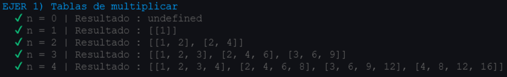

# Práctica 4 - DSI
## Arrays, tuplas y enumerados

### Introducción

En este nuevo proyecto, emplearemos un desarrollo dirigido por pruebas (TDD) y estará documentado, para lo 
que vamos a valernos de tres herramientas para llevarlo a cabo:

* [Typedoc](https://typedoc.org/): para realizar la documentación automática de nuestro codigo.
* [Mocha](https://mochajs.org/) y [Chai](https://www.chaijs.com/): para incorporar TDD.

Continuaremos con la misma estructura de directorios basada en las anteriores prácticas, añadiendo el nuevo
directorio `test` para alojar las expectativas del código y `Typedocumentation` para almacenar la
documentación generada por `Typedoc`.

Con todo esto implementaremos 10 funciones propuestas, repasando conceptos sobre los apartados vistos en 
clase:
* [Creación de un proyecto inicial con Typescript](https://ull-esit-inf-dsi-2122.github.io/typescript-theory/typescript-project-setup.html)
* [Tipos de datos estáticos](https://ull-esit-inf-dsi-2122.github.io/typescript-theory/typescript-static-types.html)
* [Funciones](https://ull-esit-inf-dsi-2122.github.io/typescript-theory/typescript-functions.html)
* [Arrays, tuplas y enumerados](https://ull-esit-inf-dsi-2122.github.io/typescript-theory/typescript-arrays-tuples-enums.html)

## Ejercicios

### Ejercicio 1 - Tablas de multiplicar

Crearemos una funcion que reciba un numero `n >= 1` y devolvera un array de arrays conteniendo `n` tablas
de multiplicar, cada una con los `n` primeros productos.

``` Typescript
export function productTable(n: number): number[][] | undefined {
  if (n < 1) {
    return undefined;
  }
  const result: number[][] = [];
  for (let i: number = 1; i <= n; i++) {
    const aux: number[] = [];
    for (let j: number = 1; j <= n; j++) {
      aux.push(i*j);
    }
    result.push(aux);
  }
  return result;
}
```
**Pruebas**
```Typescript
import {productTable} from '../src/ejer-1';

describe('EJER 1) Tablas de multiplicar', () => {
  it('n = 0 | Resultado : undefined', () => {
    expect(productTable(0)).to.be.deep.equal(undefined);
  });
  it('n = 1 | Resultado : [[1]]', () => {
    expect(productTable(1)).to.be.deep.equal([[1]]);
  });
  it('n = 2 | Resultado : [[1, 2], [2, 4]]', () => {
    expect(productTable(2)).to.be.deep.equal([[1, 2], [2, 4]]);
  });
  it('n = 3 | Resultado : [[1, 2, 3], [2, 4, 6], [3, 6, 9]]', () => {
    expect(productTable(3)).to.deep.equal([[1, 2, 3], [2, 4, 6], [3, 6, 9]]);
  });
  it('n = 4 | Resultado : [[1, 2, 3, 4], [2, 4, 6, 8], [3, 6, 9, 12], [4, 8, 12, 16]]', () => {
    expect(productTable(4)).to.deep.equal([[1, 2, 3, 4], [2, 4, 6, 8], [3, 6, 9, 12], [4, 8, 12, 16]]);
  });
});
```


***

### Ejercicio 2 - Compresión de números en rangos

Vamos a convertir un array de enteros en una cadena representando los rangos entre estos
separados por `'_'` y cada uno separado por `','`. Ejemplo:
 `[5, 6, 7, 9, 12, 13, 14] => “5_7, 9, 12_14”`
 
Para ello recorremos el vector y en cada elemento, guardamos el primero numero en `ini` y vemos si los
siguientes son consecutivos: `(v[j + 1] == v[j] + 1))`, una vez sepamos cuantos numeros consecutivos
tenemos, guardamos la posicion del ultimo en `j`, y si son el mismo, añadimos ese numero directamente a
la cadena resultado, si no (hay un rango), añadimos ese rango desde `ini` hasta `j`.

``` Typescript
export function fromArrayToRanges(v: number[]): string | undefined {
  if (v.length < 1) {
    return undefined;
  }

  let out: string = '';
  let j: number = 0;
  let c: number = 0;
  for (let i: number = 0; i < v.length; i++) {
    j = i;
    let d: number = 0;
    const ini: string = v[i].toString(); // Guardamos el primer numero del rango
    while ((j < v.length - 1) && (v[j + 1] == v[j] + 1)) {
      d++;
      j++;
      i++;
    }
    if (c > 0) {
      out += ', ';
    }
    if (d > 0) {
      out += ini + '_' + v[j].toString();
    } else {
      out += ini;
    }
    c++; // Para la coma
  }
  return out;
}
```
**Pruebas**
```Typescript
import {fromArrayToRanges, fromRangesToArray} from '../src/ejer-2';
 describe('fromArrayToRanges', () => {
    it('[] => undefined', () => {
      expect(fromArrayToRanges([])).to.be.equal(undefined);
    });
    it('[5, 6, 7, 9, 12, 13, 14] => “5_7, 9, 12_14”', () => {
      expect(fromArrayToRanges([5, 6, 7, 9, 12, 13, 14])).to.be.deep.equal('5_7, 9, 12_14');
    });
    it('[-3, -2, -1, 3, 5, 6, 7] => “-3_-1, 3, 5_7”', () => {
      expect(fromArrayToRanges([-3, -2, -1, 3, 5, 6, 7])).to.be.deep.equal('-3_-1, 3, 5_7');
    });
  });
```

Ademas, también implementaremos el proceso inverso, en el que trataremos la cadena de entrada
para separar cada rango por `','` e introducirlos en un vector.
Para cada rango `v[i]` una `string`. Comprobamos si incluye el caracter `'_'`:
* Si tiene: obtenemos las cadenas a cada lado del `'_'` , las transformamos en numeros y con
  un bucle introducimos todos los numeros includos en ese rango en el vector resultado.
* Si mo tiene: es un rango unitario, simplemente convertimos la cadena en un numero y lo
  incluimos al vector.

``` Typescript
export function fromRangesToArray(entry: string):number[] | undefined {
  const cad: string = entry.replace(/ /g, '');
  const ranges: string[] = cad.split(',');
  const output: number[] = [];

  if (cad.length < 1) {
    return undefined;
  }

  for (let i: number = 0; i < ranges.length; i++) {
    if (ranges[i].includes('_')){
      const n1: number = parseInt(ranges[i].split('_')[0]);
      const n2: number = parseInt(ranges[i].split('_')[1]);
      for (let i: number = n1; i <= n2; i++) {
        output.push(i);
      }
    } else {
      output.push(parseInt(ranges[i]));
    }
  }

  return output;
}
```
**Pruebas**
```Typescript
  describe('fromRangesToArray', () => {
    it('"" => undefined', () => {
      expect(fromArrayToRanges([])).to.be.equal(undefined);
    });
    it('“5_7, 9, 12_14” => [5, 6, 7, 9, 12, 13, 14]', () => {
      expect(fromRangesToArray('5_7, 9, 12_14')).to.be.deep.equal([5, 6, 7, 9, 12, 13, 14]);
    });
    it('“-3_-1, 3, 5_7” => [-3, -2, -1, 3, 5, 6, 7]', () => {
      expect(fromRangesToArray('-3_-1, 3, 5_7')).to.be.deep.equal([-3, -2, -1, 3, 5, 6, 7]);
    });
  });
```

